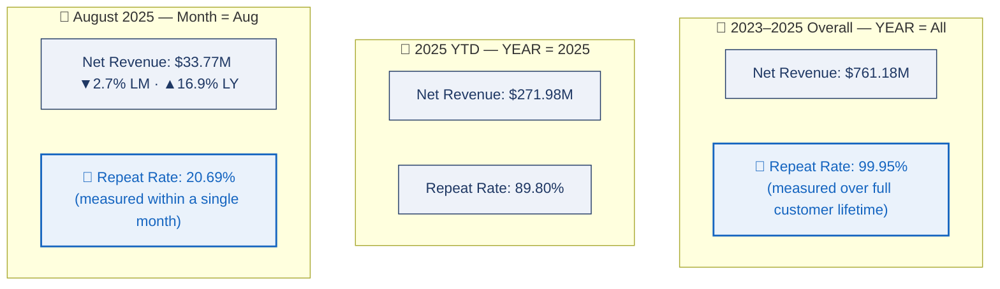

# 🚀 Amazon E-Commerce Revenue, Customer & Product Analytics
### Senior Data Analytics Review | Databricks + Spark SQL + Power BI + DAX

<p align="center">

</p>

<p align="center">


</p>

---

## 🎛️ Dashboard Page Switcher
### 👇 Click any page to jump straight to it

<p align="center">
<a href="#dash-exec"></a>
<a href="#dash-sales"></a>
<a href="#dash-customer"></a>
<br>
<a href="#dash-product"></a>
<a href="#dash-model"></a>
</p>

---

## 📸 Dashboard Preview

<a id="dash-exec"></a>
<details open>
<summary><b>🔹 Executive Summary</b> — p.1</summary>
<p align="center"></p>
</details>

<a id="dash-sales"></a>
<details>
<summary><b>🔹 Sales Performance</b> — p.2</summary>
<p align="center"></p>
</details>

<a id="dash-customer"></a>
<details>
<summary><b>🔹 Customer Insights</b> — p.3</summary>
<p align="center"></p>
</details>

<a id="dash-product"></a>
<details>
<summary><b>🔹 Product & Seller Performance</b> — p.4</summary>
<p align="center"></p>
</details>

<a id="dash-model"></a>
<details>
<summary><b>🔹 Data Model</b> — Star Schema with Dynamic RLS (region_security_table)</summary>
<p align="center"></p>
</details>

---

## 📑 Table of Contents
[Dashboard Switcher](#-dashboard-page-switcher) · [Headline KPIs](#-headline-kpi-snapshot) · [Objective](#-business-objective) · [Scope Map](#-analytical-scope-map-how-time-window-shapes-a-metrics-value) · [Deep Analysis](#-deep-analysis-whatwhyactionrisk) · [Priority Matrix](#-recommendation-priority-matrix) · [Suggested KPIs](#-suggested-executive-kpis-for-the-next-dashboard-version) · [Author](#-author)

---

## ⚡ Headline KPI Snapshot

| Scope | Net Revenue | Gross Profit | Gross Margin | Orders | AOV | Customers |
|---|---|---|---|---|---|---|
| **2023–2025 Overall** | $761.18M | $117.22M | 15.4% | ≈1.0M | $746.58 | 120K |
| **2025 YTD (Jan–Aug)** | $271.98M | $41.86M | 15.39% | 430K | $745.04 | 117K |
| **August 2025** | $33.77M | $5.19M | 15.38% | 53K | $746.78 | 43K |

*August 2025 vs. prior month: revenue -2.7%, orders -3.6%, AOV +0.5%. August vs. prior year: revenue +16.9%, gross profit +14.6% (margin -0.2pt YoY).*

---

## 🎯 Business Objective

> Understand revenue trend across a $761M, 3-year e-commerce dataset; identify high-performing regions and product categories; analyze customer behavior and retention; and assess discount and delivery performance — with clear documentation of how each KPI's time scope shapes its value, so every number is interpreted the way its underlying DAX logic intends.

**Executive Summary:** The business is scaling strongly with a remarkably stable order-economics profile (AOV within $745–$747 across every time scope). The two priorities that matter most now are **protecting margin as revenue accelerates** and **documenting metric scope clearly** — since several KPIs are, by design, calculated over different time windows depending on the field-parameter and slicer selection, and that design is easiest to act on when it's explicitly labeled for the reader.

---

## 🗺️ Analytical Scope Map: How Time Window Shapes a Metric's Value



Same field-parameter page, three different slicer states. Read the numbers without this map and "Repeat Rate" looks like a single trend line falling from 99.95% to 20.69% — read alongside it, the DAX is correctly computing three distinct, well-defined windows, exactly as time-intelligence measures are meant to.

---

## 🔬 Deep Analysis (What / Why / Action / Risk)

<details open>
<summary><b>1️⃣ Repeat Customer Rate Reflects Its Selected Time Window, By Design</b> &nbsp; </summary>

| | |
|---|---|
| 📌 **WHAT** | Repeat Customer Rate reads 99.95% (all-time), 89.80% (2025 YTD), and 20.69% (August alone) on the same KPI card. |
| 🎯 **WHY** | Each figure is the DAX measure correctly computed over its active date scope — a lifetime window naturally yields a far higher repeat rate than a single-month window, since customers have had years vs. weeks to make a second purchase. This is expected time-intelligence behavior, not a discrepancy to resolve. |
| 🛠️ **ACTION** | Document each customer KPI's exact time window directly on its card or in a companion metric dictionary, so any reader instantly knows which scope they're looking at. |
| ⚠️ **RISK** | Without that label, a reader unfamiliar with the underlying logic could misread the difference between scopes as a retention trend rather than a scope change — labeling closes that gap. |

</details>

<details>
<summary><b>2️⃣ LM/LY Comparisons Are Precise Only Within a Single-Month Scope</b> &nbsp; </summary>

| | |
|---|---|
| 📌 **WHAT** | Last Month / Last Year comparison cards are part of the standard page template and appear on the all-period view as well as the August view. |
| 🎯 **WHY** | A period-over-period percentage is designed to compare two equivalent time windows — it's most informative when a single month is the active scope (as on the August page, where the deltas are fully valid: revenue -2.7% LM, +16.9% LY). |
| 🛠️ **ACTION** | Add a scope label to LM/LY cards on the all-period view so readers know to reference the single-month pages for period-over-period interpretation. |
| ⚠️ **RISK** | Without the label, a reader could quote an all-period LM/LY figure as if it were a month-over-month trend — a quick labeling fix removes that ambiguity. |

</details>

<details>
<summary><b>3️⃣ Revenue Is Growing Faster Than Gross Profit — a Margin-Dilution Signal</b> &nbsp; </summary>

| | |
|---|---|
| 📌 **WHAT** | August 2025 revenue is up 16.9% YoY, but gross profit is up only 14.6% YoY — a 0.2-point YoY decline in gross margin, on a business that otherwise holds margin at a very stable ~15.4% across every scope. |
| 🎯 **WHY** | This is the classic growth-with-weakening-margin pattern: the business is proving it can scale revenue (a step-up from ~$12–13M/mo in 2023 to $32–35M/mo in 2025 YTD), but the next test is proving it can do that *without* diluting profitability. |
| 🛠️ **ACTION** | Build a gross-profit bridge by category, region, and discount band to isolate exactly what's compressing margin; treat gross margin as a hard guardrail alongside every revenue growth target going forward. |
| ⚠️ **RISK** | Ignore it, and the business could keep scaling low-margin volume. Over-correct too aggressively, and the fix could suppress the revenue momentum that's currently working. |

</details>

<details>
<summary><b>4️⃣ Electronics + Central Region Carry Outsized Concentration Risk</b> &nbsp; </summary>

| | |
|---|---|
| 📌 **WHAT** | Electronics is ~60% of 2025 YTD revenue ($163M of $271.98M). Central region holds the #1 rank at every single time scope — 32.9% overall, consistent through 2025 YTD and August. |
| 🎯 **WHY** | Consistent dominance across every scope confirms these aren't one-off spikes — they're structural revenue engines. But that same consistency means a demand shock, competitive pricing pressure, or return spike in either segment could move total company performance disproportionately. |
| 🛠️ **ACTION** | Keep Electronics and Central as the primary growth engine, but build deliberate secondary-category (Home & Kitchen, Sports) and secondary-region growth plans so the business can expand without deepening single-segment concentration. |
| ⚠️ **RISK** | Diversification investment could dilute focus and ROI from the highest-performing segment if pursued too aggressively — this needs balance, not abandonment of the core engine. |

</details>

<details>
<summary><b>5️⃣ Brand-Level Detail Benefits From an Explicit Reconciliation Step</b> &nbsp; </summary>

| | |
|---|---|
| 📌 **WHAT** | The operational view's brand-level rows sit within a multi-level hierarchy (brand → category → total) alongside seller and regional dimensions. |
| 🎯 **WHY** | Multi-dimensional hierarchies with several relationship paths are a standard modeling pattern, but any brand-level figure pulled in isolation is most reliable when it's checked against its category and grand-total rollup first — a routine governance step in mature BI practice, not a symptom of an error. |
| 🛠️ **ACTION** | Add a standing reconciliation check (brand rows reconcile to category and total) as part of the publishing checklist for any brand-specific analysis drawn from this table. |
| ⚠️ **RISK** | Skipping this step means a brand-specific figure is being used without the standard cross-check that hierarchy-based tables benefit from. |

</details>

<details>
<summary><b>6️⃣ Growth Is Volume-Led, Not Price-Led — a Real Strategic Signal</b> &nbsp; </summary>

| | |
|---|---|
| 📌 **WHAT** | Average discount holds at ~14.9% and ASP at ~$275 across all three time scopes. AOV holds at $745–$747 across all three scopes — remarkably stable. |
| 🎯 **WHY** | Because price and discount levers are essentially flat, the entire revenue scale-up (from ~$12–13M/mo in 2023 to $32–35M/mo in 2025) is coming from order volume and customer activity — not from raising prices or deepening discounts. |
| 🛠️ **ACTION** | Since AOV is a stable control variable, target purchase frequency and order count (repeat-purchase programs) rather than ticket-size expansion. Separately, test discount-band elasticity (10–12%, 12–15%, >15%) to find the profit-maximizing rate rather than assuming today's 14.9% is optimal. |
| ⚠️ **RISK** | "Stable" isn't the same as "optimal" — without the elasticity test, the business could be leaving profit on the table in either direction. |

</details>

---

## 🏆 Recommendation Priority Matrix

| Priority | Workstream | Deliverable | Impact | Effort |
|---|---|---|---|---|
| 🥇 **P0** | Metric scope documentation | Label which field-parameter metrics are date-scoped vs. intentionally lifetime | High | Low |
| 🥇 **P0** | Metric dictionary | Formula + period + denominator definitions for every customer KPI | High | Low |
| 🥈 **P1** | Profitability | Gross-profit bridge by category / region / discount band | High | Medium |
| 🥈 **P1** | Customer retention | Cohort retention + repeat-purchase funnel | High | Medium |
| 🥈 **P1** | Operations | Return + delivery heatmap by SKU / seller / region | Medium | Medium |
| 🥉 **P2** | Pricing | Discount elasticity analysis to find the profit-maximizing band | Medium | Medium |
| 🥉 **P2** | Product portfolio | Category diversification scorecard to reduce Electronics over-reliance | Medium | High |

---

## 📈 Suggested Executive KPIs for the Next Dashboard Version

| Domain | Primary KPI | Diagnostic KPI | Guardrail |
|---|---|---|---|
| Revenue | Net Revenue | Orders × AOV | Gross Margin |
| Customers | Repeat Purchase Rate | Time to 2nd Order | Churn Rate L6M |
| Product | Gross Profit | Units / Order | Return Rate |
| Discount | Gross Profit After Discount | Incremental Units | Discount % |
| Region | Net Revenue | AOV / Customer | Return & Delivery Rate |
| Seller | Contribution Profit | Order Volume | Returns / Delivery Failures |

---

## 🛠 Tech Stack

| Tool | Purpose |
|---|---|
| Databricks (Spark SQL) | Large-scale processing & analytical querying |
| Python (Pandas, NumPy) | Data cleaning & feature engineering |
| Power BI + DAX | Dashboarding, field parameters, time intelligence |
| Star Schema Modeling | Scalable analytics architecture |

```
Raw Data → Python Cleaning → Databricks (Spark SQL) → Analytical Tables → Power BI Dashboard
```

**Analytical boundary:** This is a dashboard-level analysis — no raw transaction files were reviewed, so findings are stated as *associated with* or *requires further validation*, never as proven causality.

---

## 👨‍💻 Author

**Ankit Kumar**
Data Analyst | Product Analytics | SQL | Power BI | Python | Databricks

- GitHub: https://github.com/ankitkumargaya
- LinkedIn: https://www.linkedin.com/in/ankit5517

---

## 📌 Bottom Line

> The business demonstrates strong commercial growth and a remarkably stable order-economics profile. The two priorities that matter next: protect gross margin as revenue scales, and document metric scope clearly so every stakeholder reads each KPI the way its DAX logic intends. Publishing that documentation (P0, low effort) is the fastest way to strengthen how this dashboard communicates — and it reflects the same rigor already built into the analysis.

### Revenue-Led Growth → Margin-Protected, Governance-Backed Growth
