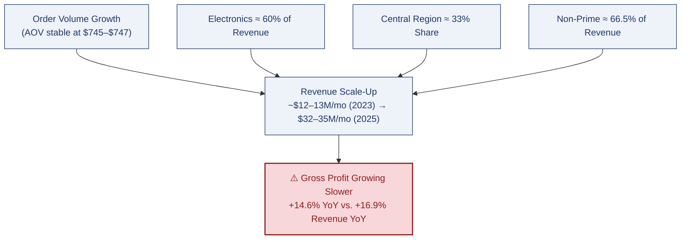

# 🚀 Amazon E-Commerce Revenue, Customer & Product Analytics
### Senior Business Analytics Review | Databricks + Spark SQL + Power BI + DAX

<p align="center">

</p>

<p align="center">


</p>

---

## 🎛️ Dashboard Page Switcher
### 👇 Click any page to jump straight to it

<p align="center">
<a href="#dash-exec"></a>
<a href="#dash-sales"></a>
<a href="#dash-customer"></a>
<br>
<a href="#dash-product"></a>
<a href="#dash-model"></a>
</p>

---

## 📸 Dashboard Preview

<a id="dash-exec"></a>
<details open>
<summary><b>🔹 Executive Summary</b> — p.1</summary>
<p align="center"></p>
</details>

<a id="dash-sales"></a>
<details>
<summary><b>🔹 Sales Performance</b> — p.2</summary>
<p align="center"></p>
</details>

<a id="dash-customer"></a>
<details>
<summary><b>🔹 Customer Insights</b> — p.3</summary>
<p align="center"></p>
</details>

<a id="dash-product"></a>
<details>
<summary><b>🔹 Product & Seller Performance</b> — p.4</summary>
<p align="center"></p>
</details>

<a id="dash-model"></a>
<details>
<summary><b>🔹 Data Model</b> — Star Schema with Dynamic RLS</summary>
<p align="center"></p>
</details>

---

## 📑 Table of Contents
[Dashboard Switcher](#-dashboard-page-switcher) · [Headline KPIs](#-headline-kpi-snapshot) · [Objective](#-business-objective) · [Revenue Engine Map](#-whats-driving-27198m-in-2025-ytd-revenue) · [Business Insights](#-business-insights-insight--action--risk) · [Priority Matrix](#-recommendation-priority-matrix) · [KPI Framework](#-recommended-kpi-framework-going-forward) · [Author](#-author)

---

## ⚡ Headline KPI Snapshot

| Scope | Net Revenue | Gross Profit | Gross Margin | Orders | AOV | Customers |
|---|---|---|---|---|---|---|
| **2023–2025 Overall** | $761.18M | $117.22M | 15.4% | ≈1.0M | $746.58 | 120K |
| **2025 YTD (Jan–Aug)** | $271.98M | $41.86M | 15.39% | 430K | $745.04 | 117K |
| **August 2025** | $33.77M | $5.19M | 15.38% | 53K | $746.78 | 43K |

*August 2025 vs. prior year: revenue +16.9%, gross profit +14.6% (margin -0.2pt YoY).*

---

## 🎯 Business Objective

> Understand the revenue trend across a $761M, 3-year e-commerce business; identify the highest-performing regions and product categories; analyze customer behavior and retention; and assess discount and delivery performance to find the highest-leverage actions for protecting margin while sustaining growth.

**Executive Summary:** The business is scaling fast on a genuinely healthy foundation — stable order economics, healthy delivery performance, and a broad, non-Prime-dependent customer base. The single biggest thing to get right next is protecting gross margin as that growth continues, because profit is already growing slightly slower than revenue.

---

## 🗺️ What's Driving $271.98M in 2025 YTD Revenue



Four things are driving growth at once — and only one of them (margin) is currently a concern.

---

## 🔬 Business Insights (Insight → Action → Risk)

<details open>
<summary><b>1️⃣ Revenue Is Scaling Fast, But Margin Growth Is Starting to Lag</b> &nbsp; </summary>

| | |
|---|---|
| 📌 **INSIGHT** | August revenue is up 16.9% YoY, but gross profit is up only 14.6% YoY — margin down 0.2pt YoY on a business that otherwise holds a very stable ~15.4% margin. |
| 🎯 **WHY IT MATTERS** | This is the classic growth-with-weakening-margin pattern. The business has already proven it can scale revenue; the next test is proving it can do that without giving up profitability along the way. |
| 🛠️ **ACTION** | Build a gross-profit bridge by category, region, and discount band to pinpoint exactly what's compressing margin, and set gross margin as a hard guardrail alongside every revenue growth target. |
| ⚠️ **RISK** | Ignore it, and the business keeps scaling low-margin volume. Overcorrect too hard on cost or discount cuts, and it could choke off the growth momentum that's currently working. |

</details>

<details>
<summary><b>2️⃣ Electronics + Central Region Are Carrying the Business</b> &nbsp; </summary>

| | |
|---|---|
| 📌 **INSIGHT** | Electronics drives ~60% of 2025 YTD revenue ($163M of $271.98M). Central region holds the #1 rank consistently across every period (~33% share). |
| 🎯 **WHY IT MATTERS** | Repeating across every time period confirms these are durable, structural revenue engines — but that same consistency means a demand shock, pricing pressure, or return spike in either segment could move total performance disproportionately. |
| 🛠️ **ACTION** | Keep Electronics and Central as the primary growth engine, but build parallel growth bets in Home & Kitchen, Sports, and secondary regions to reduce single-segment dependence. |
| ⚠️ **RISK** | Diversifying too aggressively could dilute focus and ROI from the highest-performing segment — this needs balance, not abandoning what's working. |

</details>

<details>
<summary><b>3️⃣ Growth Is Coming From Volume, Not Price — A Lever Worth Testing Further</b> &nbsp; </summary>

| | |
|---|---|
| 📌 **INSIGHT** | AOV holds steady at $745–$747 and average discount holds steady at ~14.9% across every time period. All of the revenue scale-up is coming from order volume and customer activity, not price or discount changes. |
| 🎯 **WHY IT MATTERS** | Purchase frequency, not pricing, is the real growth lever right now — and a stable discount rate isn't necessarily the *profit-maximizing* one; it just hasn't been tested against alternatives. |
| 🛠️ **ACTION** | Invest in repeat-purchase and order-frequency programs rather than ticket-size plays, and run a discount-band elasticity test (10–12%, 12–15%, >15%) to find the rate that maximizes profit, not just revenue. |
| ⚠️ **RISK** | Without the elasticity test, the business could be leaving profit on the table in either direction — discounting slightly more or slightly less than optimal. |

</details>

<details>
<summary><b>4️⃣ Non-Prime Customers Are the Real Revenue Engine — And an Untapped Upgrade Path</b> &nbsp; </summary>

| | |
|---|---|
| 📌 **INSIGHT** | Non-Prime customers generate ~66.5% of revenue, consistently, across every time period — Prime customers contribute the remaining ~33.5%. |
| 🎯 **WHY IT MATTERS** | This is a broad-based revenue engine that isn't dependent on one loyalty tier — a healthy position. It also means Prime conversion is a largely untapped growth lever, since Prime customers typically carry higher lifetime value once converted. |
| 🛠️ **ACTION** | Launch a targeted Non-Prime → Prime conversion campaign, and track AOV and repeat-rate lift post-conversion to confirm the higher-value thesis before scaling it. |
| ⚠️ **RISK** | An overly aggressive conversion push (heavy incentives) could erode margin if converted customers don't increase order value enough to offset the incentive cost. |

</details>

<details>
<summary><b>5️⃣ Delivery & Returns Are Already Healthy — The Opportunity Is in the Outliers</b> &nbsp; </summary>

| | |
|---|---|
| 📌 **INSIGHT** | Return rate holds at a healthy 0.7–0.8% and delivered-order rate at ~85% consistently across every time period for the business's largest category. |
| 🎯 **WHY IT MATTERS** | Since the average is already strong, the more valuable question isn't "are returns a problem" — they're not — it's which specific products, sellers, regions, or discount bands are quietly running above-average returns or delivery issues, since that's where corrective action actually pays off. |
| 🛠️ **ACTION** | Build a returns/delivery outlier heatmap segmented by SKU, seller, and region instead of only monitoring the topline rate. |
| ⚠️ **RISK** | Without that segmentation, an underperforming pocket could stay hidden inside a healthy-looking overall average indefinitely. |

</details>

<details>
<summary><b>6️⃣ A Small Group of Sellers Consistently Outperform Across Regions</b> &nbsp; </summary>

| | |
|---|---|
| 📌 **INSIGHT** | A handful of seller brands repeatedly appear among the top-performing seller-region combinations across North, South, and Central alike. |
| 🎯 **WHY IT MATTERS** | Repeated performance across multiple regions is a much stronger signal than one good month in one place — it points to something these sellers are doing right that's worth understanding and replicating. |
| 🛠️ **ACTION** | Study what these top sellers are doing differently (pricing, fulfillment, catalog depth) and pilot bringing similar terms or support to comparable sellers in underperforming regions. |
| ⚠️ **RISK** | Regional or category mix could be inflating their apparent performance — validate with a controlled comparison before rolling out incentives business-wide. |

</details>

---

## 🏆 Recommendation Priority Matrix

| Priority | Recommendation | Impact | Effort |
|---|---|---|---|
| 🥇 **P0** | Build a gross-profit bridge by category/region/discount band to protect margin | High | Medium |
| 🥇 **P0** | Run a discount-band elasticity test to find the profit-maximizing rate | High | Medium |
| 🥈 **P1** | Launch a Non-Prime → Prime conversion campaign | High | Medium |
| 🥈 **P1** | Build repeat-purchase & order-frequency programs | High | Medium |
| 🥈 **P1** | Build a returns/delivery outlier heatmap by SKU, seller, and region | Medium | Medium |
| 🥉 **P2** | Diversify into secondary categories & regions (Home & Kitchen, Sports) | Medium | High |
| 🥉 **P2** | Study and replicate top-seller success factors across underperforming regions | Medium | Medium |

---

## 📈 Recommended KPI Framework Going Forward

| Domain | Primary KPI | Diagnostic KPI | Guardrail |
|---|---|---|---|
| Revenue | Net Revenue | Orders × AOV | Gross Margin |
| Customers | Repeat Purchase Rate | Time to 2nd Order | Churn Rate L6M |
| Product | Gross Profit | Units / Order | Return Rate |
| Discount | Gross Profit After Discount | Incremental Units | Discount % |
| Region | Net Revenue | AOV / Customer | Return & Delivery Rate |
| Seller | Contribution Profit | Order Volume | Returns / Delivery Failures |

---

## 🛠 Tech Stack

| Tool | Purpose |
|---|---|
| Databricks (Spark SQL) | Large-scale processing & analytical querying |
| Python (Pandas, NumPy) | Data cleaning & feature engineering |
| Power BI + DAX | Dashboarding, field parameters, time intelligence |
| Star Schema Modeling | Scalable analytics architecture |

```
Raw Data → Python Cleaning → Databricks (Spark SQL) → Analytical Tables → Power BI Dashboard
```

---

## 👨‍💻 Author

**Ankit Kumar**
Data Analyst | Product Analytics | SQL | Power BI | Python | Databricks

- GitHub: https://github.com/ankitkumargaya
- LinkedIn: https://www.linkedin.com/in/ankit5517

---

## 📌 Bottom Line

> This business is scaling well on a genuinely healthy foundation — stable order economics, strong delivery performance, and a broad customer base that isn't dependent on one segment. The highest-leverage moves from here: protect gross margin as growth continues, convert more of the large Non-Prime base into higher-value Prime relationships, and double down on the volume-led growth strategy that's already working — with a data-driven test to confirm the current discount rate is truly the profit-maximizing one.

### Fast Growth → Margin-Protected, Insight-Led Growth
