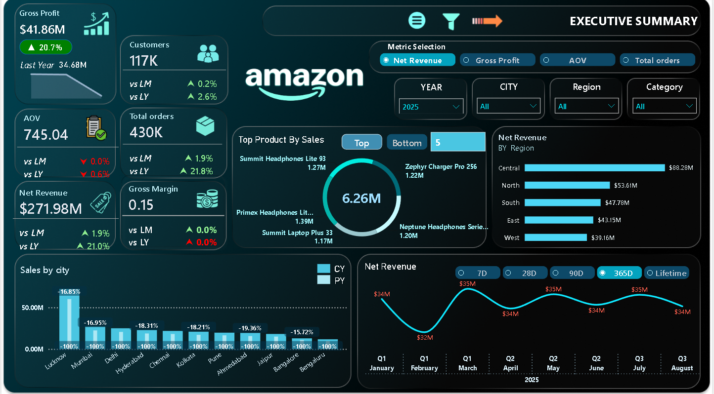
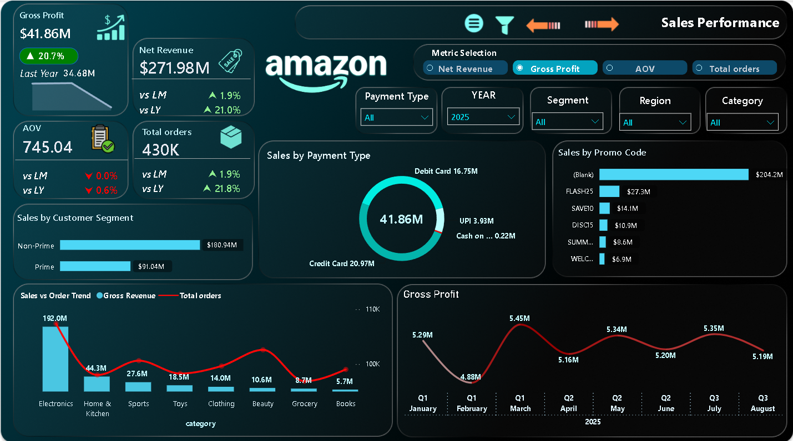
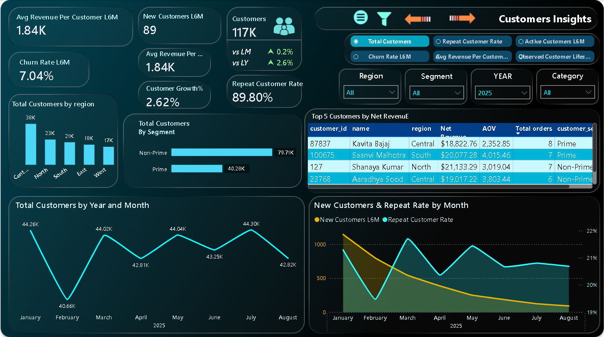
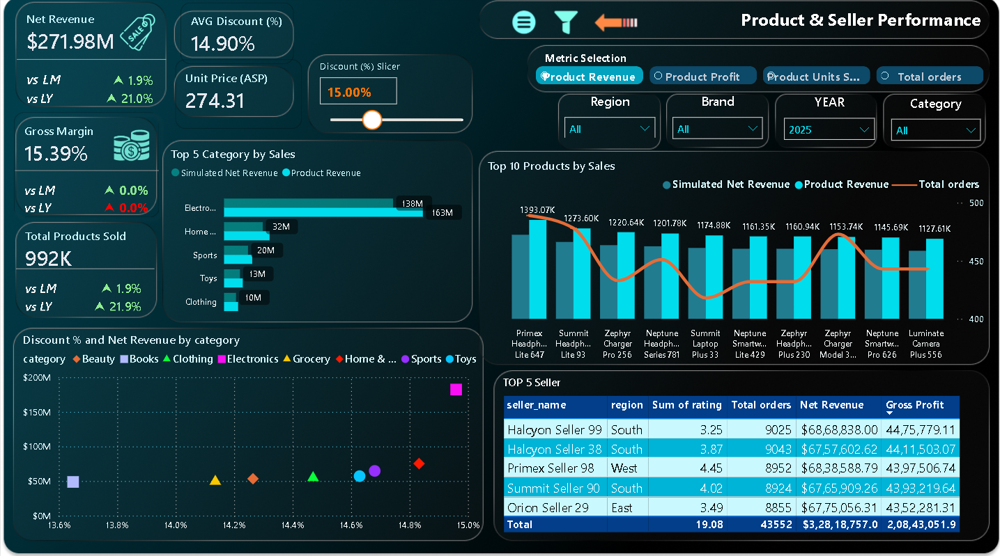
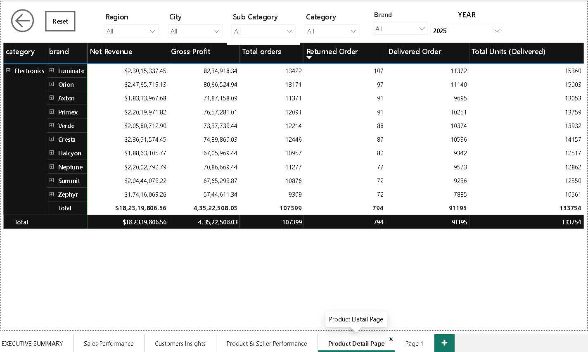
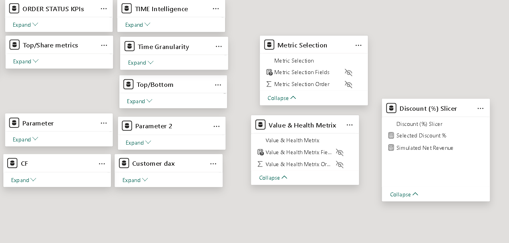
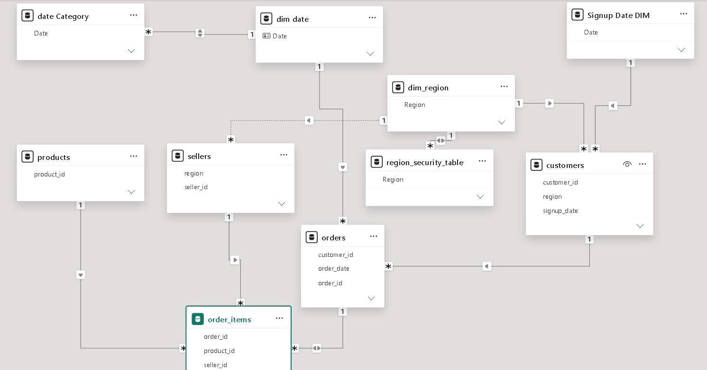

# E-Commerce Sales Analytics Dashboard  
### End-to-End Business Intelligence Project | Power BI + SQL + Python + AWS



---

# 📌 Project Overview

This project is a complete end-to-end E-Commerce Analytics solution built using **Power BI, SQL, Python, AWS S3, and Amazon Athena** to analyze business performance, customer behavior, customer retention, product profitability, and seller performance using **50,000+ transactional records**.

The dashboard was designed to simulate a real-world analytics environment used by modern e-commerce and product-based companies such as Amazon, Flipkart, Myntra, and Walmart.

The solution transforms raw transactional data into actionable business insights for leadership, operations, marketing, and product teams.

---

# 🎯 Business Objective

The primary objective of this project was to help business stakeholders answer critical business questions such as:

- How is revenue growing Month-over-Month (MoM) and Year-over-Year (YoY)?
- Which products, categories, and regions generate the highest revenue?
- How do discounts affect profitability and sales performance?
- Which customers contribute most to business growth?
- How strong is customer retention and repeat purchase behavior?
- Which sellers and products perform best across regions?
- How can leadership identify growth opportunities using data?
- How can cloud-based analytics improve scalability and reporting efficiency?

---

# 🛠 Tech Stack

| Tool / Technology | Purpose |
|---|---|
| Python (Pandas, NumPy) | Data Cleaning & Preprocessing |
| SQL | Data Validation & Business Analysis |
| AWS S3 | Cloud Storage for Raw & Processed Data |
| Amazon Athena | Cloud SQL Query Engine |
| Power BI | Dashboard Development & Visualization |
| DAX | KPI Calculations & Time Intelligence |
| Power Query | Data Transformation |
| Star Schema Modeling | Scalable BI Architecture |
| Dynamic Row-Level Security (RLS) | Secure Region-Based Data Access |

---

# ☁️ Cloud Architecture

This project incorporates AWS cloud services to simulate a modern cloud-based analytics workflow used in real organizations.

## AWS Services Used

### 🔹 Amazon S3
Used as a centralized cloud storage layer for storing:

- Raw transactional datasets
- Cleaned datasets
- Processed analytical files
- CSV exports for reporting

### 🔹 Amazon Athena
Used to run SQL queries directly on data stored in S3 without requiring a traditional database server.

Athena was used for:

- Revenue analysis
- Customer segmentation
- KPI validation
- Product performance analysis
- Repeat customer analysis
- Retention-related queries

## Cloud Workflow

Raw Data → Python Cleaning → Upload to AWS S3 → Query using Athena → Connect to Power BI → Dashboard Reporting

---

# 📂 Dataset Information

The project uses a relational multi-table dataset designed like a real-world e-commerce data warehouse.

## Tables Used

| Table Name | Description |
|---|---|
| customers | Customer details and signup information |
| orders | Order-level transactional data |
| order_items | Product-level order transactions |
| products | Product category and pricing details |
| sellers | Seller and regional information |
| dim_date | Calendar/date dimension |
| dim_region | Regional dimension |
| region_security_table | Used for Dynamic Row-Level Security |

---

# 🧩 Data Modeling

A professional **Star Schema Data Model** was implemented for scalable analytics and optimized dashboard performance.

## Model Highlights

- One-to-Many relationships
- Dimension & Fact table separation
- Dedicated Date Dimension
- Region Security Mapping
- Optimized filtering performance
- Time Intelligence support using DAX
- Scalable cloud-query architecture using Athena

---

# 🧹 Data Cleaning & Preparation

Python (Pandas & NumPy) was used for preprocessing and quality checks.

## Cleaning Steps

- Removed duplicates
- Handled missing/null values
- Fixed inconsistent data types
- Standardized text fields
- Validated order-level calculations
- Created derived business metrics
- Performed data integrity checks

---

# 🧠 SQL & Athena Analysis

SQL and Amazon Athena were used for:

- Multi-table joins
- KPI validation
- Revenue analysis
- Customer segmentation
- Repeat customer analysis
- Delivery & cancellation analysis
- Seller performance validation
- Product-level aggregation
- Retention-related calculations

## Example Business Metrics

- Total Revenue
- Gross Profit
- Average Order Value (AOV)
- Repeat Customer %
- Annual Churn Rate
- Gross Margin %
- Delivery Rate
- Cancel Rate
- Customer Lifetime Value (LTV)

---

# 🔐 Dynamic Row-Level Security (Dynamic RLS)

Implemented **Dynamic Row-Level Security (RLS)** in Power BI to provide secure region-based data access dynamically based on logged-in users.

## Dynamic RLS Workflow

- Created a `region_security_table` containing:
  - User Email
  - Assigned Region

- Established relationship between:
  - `region_security_table`
  - `dim_region`

- Applied Dynamic RLS using DAX:

```DAX
[User_Email] = USERPRINCIPALNAME()
```

## Business Purpose of Dynamic RLS

Dynamic RLS allows organizations to:

- Restrict users to view only their assigned regional data
- Improve dashboard security and governance
- Enable secure multi-user reporting environments
- Simulate enterprise-level Power BI deployment scenarios

## Example Use Case

| User | Accessible Region |
|---|---|
| north_manager@company.com | North |
| west_manager@company.com | West |
| central_manager@company.com | Central |

This ensures each regional manager can only access their own business data while leadership teams retain full visibility.

---

# 📊 Dashboard Features

The dashboard contains multiple business-focused pages with interactive analytics.

---

# 📈 Dashboard Pages

# 1️⃣ Executive Summary

Provides a high-level business overview for leadership teams.

## Key KPIs

- Gross Profit
- Net Revenue
- Total Orders
- Customers
- Gross Margin %
- Average Order Value (AOV)

## Key Insights

- Central region contributes the highest order volume
- Revenue distribution is balanced across major cities
- Gross margin remains strong at ~31%
- Revenue performance is stable across multiple categories
- Top products contribute a major portion of total revenue

---

# 2️⃣ Sales Performance Dashboard

Focused on revenue and operational performance tracking.

## Analysis Included

- Sales trend analysis
- Payment type analysis
- Promo code performance
- Customer segment revenue
- Monthly order trends
- Revenue growth tracking

## Key Insights

- Non-prime customers generated higher total revenue
- Wallet and card payments dominate transactions
- Promo codes contributed significant incremental revenue
- Sales showed seasonal fluctuations across months
- Order volume increased during promotional periods

---

# 3️⃣ Customer Insights Dashboard

Focused on retention, LTV, churn, and customer growth.

## Metrics Included

- Average Customer Lifetime Value (LTV)
- Repeat Customer %
- Annual Churn Rate
- Customer Growth %
- New Customer Trend
- Regional Customer Performance

## Key Insights

- Repeat customers contribute the majority of total revenue
- Customer retention is a strong revenue driver
- LTV growth indicates long-term customer value
- Churn fluctuations reveal customer lifecycle drop-off periods
- Central and East regions show stronger customer engagement

---

# 4️⃣ Product & Seller Performance Dashboard

Focused on product profitability and seller efficiency.

## Analysis Included

- Top-selling products
- Category profitability
- Seller ranking
- Discount impact simulation
- Product revenue contribution
- Gross margin analysis

## Key Insights

- Electronics generated the highest revenue
- Some categories showed higher discount dependency
- Top sellers significantly outperform average sellers
- Discount optimization can improve margin efficiency
- Seller ratings strongly correlate with sales performance

---

# ⚡ Advanced Power BI Features

## Implemented Features

- Dynamic KPI Selection
- Field Parameters
- Drill-down Functionality
- Drill-through Navigation
- Interactive Slicers
- Custom Page Navigation
- Dynamic Titles
- YoY & MoM Growth Analysis
- Conditional Formatting
- Tooltip Enhancements
- Dynamic Row-Level Security (Dynamic RLS)

---

# 💼 Business Impact

This dashboard enables business teams to:

- Monitor business performance in real time
- Query large datasets efficiently using Athena
- Store scalable datasets securely in AWS S3
- Identify high-value customers
- Optimize pricing and discount strategies
- Improve customer retention
- Track seller efficiency
- Analyze product profitability
- Support data-driven business decisions

---

# 🚀 Strategic Recommendations

# 1️⃣ Improve Customer Retention

Repeat customers contribute a significant portion of revenue.

## Recommended Actions

- Launch loyalty programs
- Create personalized recommendations
- Run email remarketing campaigns
- Reduce time between first and second purchase

---

# 2️⃣ Optimize Discount Strategy

Some categories rely heavily on discounts.

## Recommended Actions

- Introduce targeted promotions
- Avoid excessive blanket discounts
- Focus on margin-protected campaigns
- Monitor category-wise discount efficiency

---

# 3️⃣ Expand High-Performing Categories

Electronics and beauty categories show strong revenue contribution.

## Recommended Actions

- Increase inventory availability
- Improve seller onboarding
- Run category-specific campaigns
- Expand premium product offerings

---

# 4️⃣ Improve Seller Quality Monitoring

Top sellers outperform significantly.

## Recommended Actions

- Build seller performance scorecards
- Monitor seller ratings and cancellations
- Reward high-performing sellers
- Reduce operational inefficiencies

---

# 5️⃣ Strengthen Customer Lifecycle Analytics

Churn patterns indicate lifecycle drop-off periods.

## Recommended Actions

- Trigger retention campaigns earlier
- Monitor inactive customer windows
- Build predictive churn models
- Improve onboarding experience

---

# 🔑 Key Skills Demonstrated

- Business Intelligence
- Data Modeling
- SQL Analytics
- Amazon Athena
- AWS S3
- Power BI Dashboarding
- DAX Calculations
- Customer Analytics
- Product Analytics
- Revenue Analysis
- KPI Design
- Data Cleaning
- Data Storytelling
- Dynamic Row-Level Security (RLS)
- Cloud-Based Analytics Workflow

---

# 📷 Dashboard Screenshots

## Executive Summary


---

## Sales Performance Dashboard



---

## Customer Insights Dashboard



---

## Product & Seller Performance Dashboard



---

## Product Drill-Through Page

This drill-through page enables detailed product-level analysis including revenue contribution, seller performance, order trends, profitability, and customer purchasing behavior.



---

## Measures Table & KPI Architecture

This image shows the centralized measures table used for managing reusable DAX measures and KPI calculations across the dashboard.



---

## Data Model

The project follows a professional Star Schema architecture optimized for scalable analytics and performance.


---

# 👨‍💻 Author

## Ankit Kumar  
Aspiring Data Analyst | Power BI | SQL | Python | AWS | Business Analytics

- GitHub: https://github.com/ankitkumargaya
- LinkedIn: Add Your LinkedIn Profile Here

---

# 📌 Final Conclusion

This project demonstrates how raw e-commerce transactional data can be transformed into a scalable business intelligence solution capable of supporting executive-level decision making.

The dashboard combines:

- Data Engineering Concepts
- Cloud-Based Analytics
- Business Intelligence
- Customer Analytics
- Product Analytics
- Advanced Power BI Development
- SQL & Athena Querying
- Real-World KPI Tracking

This project reflects practical analytics skills used in modern product-based and e-commerce organizations.
