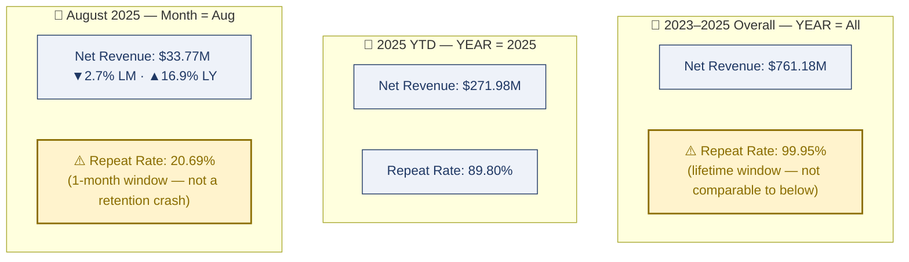

# 🚀 Amazon E-Commerce Revenue, Customer & Product Analytics
### Senior Data Analytics Review | Databricks + Spark SQL + Power BI + DAX

<p align="center">

</p>

> ⚠️ **Maintenance note:** The screenshots below are from the project's prior dataset version. This README's numbers reflect the current, larger dataset ($761.18M revenue / 120K customers / Databricks pipeline). Replace `executive_summary.png`, `sales_performance.png`, `customer_insights.png`, `product_seller_performance.png`, and add `operational_matrix.png` with current exports before publishing.

<p align="center">


</p>

---

## 🎛️ Dashboard Page Switcher
### 👇 Click any page to jump straight to it

<p align="center">
<a href="#dash-exec"></a>
<a href="#dash-sales"></a>
<a href="#dash-customer"></a>
<br>
<a href="#dash-product"></a>
<a href="#dash-ops"></a>
</p>

---

## 📸 Dashboard Preview

<a id="dash-exec"></a>
<details open>
<summary><b>🔹 Executive Summary</b> — p.1</summary>
<p align="center"></p>
</details>

<a id="dash-sales"></a>
<details>
<summary><b>🔹 Sales Performance</b> — p.2</summary>
<p align="center"></p>
</details>

<a id="dash-customer"></a>
<details>
<summary><b>🔹 Customer Insights</b> — p.3</summary>
<p align="center"></p>
</details>

<a id="dash-product"></a>
<details>
<summary><b>🔹 Product & Seller Performance</b> — p.4</summary>
<p align="center"></p>
</details>

<a id="dash-ops"></a>
<details>
<summary><b>🔹 Operational Matrix</b> — p.5 (returns, delivery, brand-level detail)</summary>
<p align="center"></p>
</details>

---

## 📑 Table of Contents
[Dashboard Switcher](#-dashboard-page-switcher) · [Headline KPIs](#-headline-kpi-snapshot) · [Objective](#-business-objective) · [Scope Map](#-analytical-scope-map-why-the-same-metric-shows-three-different-numbers) · [Deep Analysis](#-deep-analysis-whatwhyactionrisk) · [Priority Matrix](#-recommendation-priority-matrix) · [Suggested KPIs](#-suggested-executive-kpis-for-the-next-dashboard-version) · [Author](#-author)

---

## ⚡ Headline KPI Snapshot

| Scope | Net Revenue | Gross Profit | Gross Margin | Orders | AOV | Customers |
|---|---|---|---|---|---|---|
| **2023–2025 Overall** | $761.18M | $117.22M | 15.4% | ≈1.0M | $746.58 | 120K |
| **2025 YTD (Jan–Aug)** | $271.98M | $41.86M | 15.39% | 430K | $745.04 | 117K |
| **August 2025** | $33.77M | $5.19M | 15.38% | 53K | $746.78 | 43K |

*August 2025 vs. prior month: revenue -2.7%, orders -3.6%, AOV +0.5%. August vs. prior year: revenue +16.9%, gross profit +14.6% (margin -0.2pt YoY).*

---

## 🎯 Business Objective

> Understand revenue trend across a $761M, 3-year e-commerce dataset; identify high-performing regions and product categories; analyze customer behavior and retention; and assess discount and delivery performance — while explicitly separating slicer-responsive metrics from intentionally time-independent ones, so executives never mistake a scope difference for a data-quality failure.

**Executive Summary:** The business is scaling strongly with a remarkably stable order-economics profile (AOV within $745–$747 across every time scope). The two priorities that actually matter now are **protecting margin as revenue accelerates** and **making metric scope explicit** — because several headline numbers change dramatically depending on which time window you're looking at, and that difference is routinely mistaken for a business problem.

---

## 🗺️ Analytical Scope Map: Why the Same Metric Shows Three Different Numbers



Three PDFs, three different slicer states, same field-parameter page. Read left-to-right without this map, "Repeat Rate" looks like it collapsed from 99.95% to 20.69% — read correctly, it's three different measurement windows, not one falling number.

---

## 🔬 Deep Analysis (What / Why / Action / Risk)

<details open>
<summary><b>1️⃣ "Repeat Customer Rate" Is a Scope Artifact, Not a Retention Crash</b> &nbsp; </summary>

| | |
|---|---|
| 📌 **WHAT** | Repeat Customer Rate reads 99.95% (all-time), 89.80% (2025 YTD), and 20.69% (August alone) — the same KPI card, three wildly different numbers. |
| 🎯 **WHY** | These are three different measurement windows, not three snapshots of a declining trend. A one-month window mechanically produces a much lower repeat rate than a multi-year window — without explicit labeling, this reads as a collapse when it isn't one. |
| 🛠️ **ACTION** | Publish a metric dictionary with the exact numerator, denominator, and time window for every customer KPI; make the active field-parameter and date scope visible directly in each visual's title. |
| ⚠️ **RISK** | Unlabeled, an executive could wrongly panic over a "retention collapse" that's a scope artifact — or, just as dangerous, dismiss a real future retention problem as "just another scope issue." |

</details>

<details>
<summary><b>2️⃣ LM/LY Indicators Are Meaningless on the All-Period View</b> &nbsp; </summary>

| | |
|---|---|
| 📌 **WHAT** | The 2023–2025 overall dashboard displays Last Month / Last Year comparison cards even though no single month is selected (YEAR = All). |
| 🎯 **WHY** | A percentage-change indicator only means something when comparing two well-defined, equivalent periods. Showing LM/LY on an all-time aggregate invites a false growth or decline narrative that isn't actually being measured. |
| 🛠️ **ACTION** | Suppress LM comparison cards on multi-period/all-time views. Only surface LM/LY deltas on single-month-scoped pages (like the August view, where they are valid), with the scope labeled directly on the card. |
| ⚠️ **RISK** | Low-effort fix, but skipping it risks an executive quoting a meaningless percentage in a board deck — a credibility risk larger than the fix itself. |

</details>

<details>
<summary><b>3️⃣ Revenue Is Growing Faster Than Gross Profit — a Margin-Dilution Signal</b> &nbsp; </summary>

| | |
|---|---|
| 📌 **WHAT** | August 2025 revenue is up 16.9% YoY, but gross profit is up only 14.6% YoY — a 0.2-point YoY decline in gross margin, on a business that otherwise holds margin at a very stable ~15.4% across every scope. |
| 🎯 **WHY** | This is the classic growth-with-weakening-margin pattern: the business is proving it can scale revenue (a step-up from ~$12–13M/mo in 2023 to $32–35M/mo in 2025 YTD), but the next test is proving it can do that *without* diluting profitability. |
| 🛠️ **ACTION** | Build a gross-profit bridge by category, region, and discount band to isolate exactly what's compressing margin; treat gross margin as a hard guardrail alongside every revenue growth target going forward. |
| ⚠️ **RISK** | Ignore it, and the business could keep scaling low-margin volume. Over-correct too aggressively, and the fix could suppress the revenue momentum that's currently working. |

</details>

<details>
<summary><b>4️⃣ Electronics + Central Region Carry Outsized Concentration Risk</b> &nbsp; </summary>

| | |
|---|---|
| 📌 **WHAT** | Electronics is ~60% of 2025 YTD revenue ($163M of $271.98M). Central region holds the #1 rank at every single time scope — 32.9% overall, consistent through 2025 YTD and August. |
| 🎯 **WHY** | Consistent dominance across every scope confirms these aren't one-off spikes — they're structural revenue engines. But that same consistency means a demand shock, competitive pricing pressure, or return spike in either segment could move total company performance disproportionately. |
| 🛠️ **ACTION** | Keep Electronics and Central as the primary growth engine, but build deliberate secondary-category (Home & Kitchen, Sports) and secondary-region growth plans so the business can expand without deepening single-segment concentration. |
| ⚠️ **RISK** | Diversification investment could dilute focus and ROI from the highest-performing segment if pursued too aggressively — this needs balance, not abandonment of the core engine. |

</details>

<details>
<summary><b>5️⃣ Operational Table Brand Rows Don't Reconcile to Displayed Totals</b> &nbsp; </summary>

| | |
|---|---|
| 📌 **WHAT** | On both the 2025 YTD and August operational matrix (p.5), the visible brand-level rows sum to more than the displayed total row. |
| 🎯 **WHY** | This points to a hierarchy or semantic-model issue (likely double-counting in the brand dimension) rather than a display bug, and it undermines confidence in any brand-level contribution analysis pulled from this page. |
| 🛠️ **ACTION** | Implement a row-to-total reconciliation check (brand rows must sum to category and grand totals) before publishing any brand-specific analysis from this table. |
| ⚠️ **RISK** | Until reconciled, any business decision citing a specific brand's revenue or profit contribution from this page carries an unverified number. |

</details>

<details>
<summary><b>6️⃣ Growth Is Volume-Led, Not Price-Led — a Real Strategic Signal</b> &nbsp; </summary>

| | |
|---|---|
| 📌 **WHAT** | Average discount holds at ~14.9% and ASP at ~$275 across all three time scopes. AOV holds at $745–$747 across all three scopes — remarkably stable. |
| 🎯 **WHY** | Because price and discount levers are essentially flat, the entire revenue scale-up (from ~$12–13M/mo in 2023 to $32–35M/mo in 2025) is coming from order volume and customer activity — not from raising prices or deepening discounts. |
| 🛠️ **ACTION** | Since AOV is a stable control variable, target purchase frequency and order count (repeat-purchase programs) rather than ticket-size expansion. Separately, test discount-band elasticity (10–12%, 12–15%, >15%) to find the profit-maximizing rate rather than assuming today's 14.9% is optimal. |
| ⚠️ **RISK** | "Stable" isn't the same as "optimal" — without the elasticity test, the business could be leaving profit on the table in either direction. |

</details>

---

## 🏆 Recommendation Priority Matrix

| Priority | Workstream | Deliverable | Impact | Effort |
|---|---|---|---|---|
| 🥇 **P0** | Metric scope governance | Document which field-parameter metrics respect the date slicer vs. are intentionally overall | High | Low |
| 🥇 **P0** | Metric dictionary | Formula + period + denominator definitions for every customer KPI | High | Low |
| 🥈 **P1** | Profitability | Gross-profit bridge by category / region / discount band | High | Medium |
| 🥈 **P1** | Customer retention | Cohort retention + repeat-purchase funnel | High | Medium |
| 🥈 **P1** | Operations | Return + delivery heatmap by SKU / seller / region | Medium | Medium |
| 🥉 **P2** | Pricing | Discount elasticity analysis to find the profit-maximizing band | Medium | Medium |
| 🥉 **P2** | Product portfolio | Category diversification scorecard to reduce Electronics over-reliance | Medium | High |

---

## 📈 Suggested Executive KPIs for the Next Dashboard Version

| Domain | Primary KPI | Diagnostic KPI | Guardrail |
|---|---|---|---|
| Revenue | Net Revenue | Orders × AOV | Gross Margin |
| Customers | Repeat Purchase Rate | Time to 2nd Order | Churn Rate L6M |
| Product | Gross Profit | Units / Order | Return Rate |
| Discount | Gross Profit After Discount | Incremental Units | Discount % |
| Region | Net Revenue | AOV / Customer | Return & Delivery Rate |
| Seller | Contribution Profit | Order Volume | Returns / Delivery Failures |

---

## 🛠 Tech Stack

| Tool | Purpose |
|---|---|
| Databricks (Spark SQL) | Large-scale processing & analytical querying |
| Python (Pandas, NumPy) | Data cleaning & feature engineering |
| Power BI + DAX | Dashboarding, field parameters, time intelligence |
| Star Schema Modeling | Scalable analytics architecture |

```
Raw Data → Python Cleaning → Databricks (Spark SQL) → Analytical Tables → Power BI Dashboard
```

**Analytical boundary:** This is a dashboard-level analysis — no raw transaction files were reviewed, so findings are stated as *associated with* or *requires further validation*, never as proven causality.

---

## 👨‍💻 Author

**Ankit Kumar**
Data Analyst | Product Analytics | SQL | Power BI | Python | Databricks

- GitHub: https://github.com/ankitkumargaya
- LinkedIn: https://www.linkedin.com/in/ankit5517

---

## 📌 Bottom Line

> The business demonstrates strong commercial growth and a remarkably stable order-economics profile. The two things that matter next: protect gross margin as revenue scales, and make metric scope explicit so a slicer-driven number is never mistaken for a business trend. Fixing metric governance (P0, low effort) removes the single biggest risk of this dashboard being misread by an executive — and it's also the fastest win on the list.

### Revenue-Led Growth → Margin-Protected, Governance-Backed Growth
